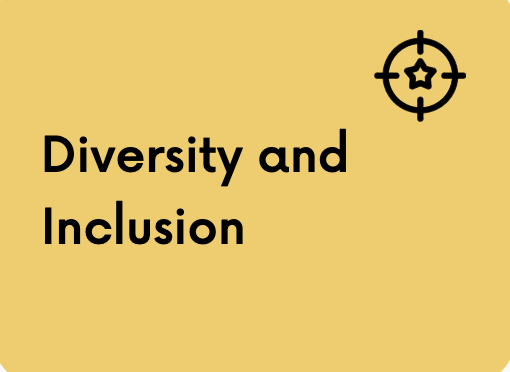

# Techrity

Techrity is a **Not-for-profit** organization.

Techrity helps kickstart beginners in tech careers by providing vital resources like Data, laptops and mentorship support for their journey to be a success. 

Techrity mentorship program connects people who have specific skills such as coding, product management, project management, writing, etc. and knowledge (mentors) with individuals (proteges) who may need these same skills to develop their skill set.

The #Build4SocialGood Hackathon identifies specific challenges for teams to build and provide solutions for social good challenges. Hackathon participants also get access to mentors to support and direct them during the hackathon phase.

We are all about creating equal access to opportunities in Tech for Africans.

## Mission statement
Creating equal access to opportunities in Tech for Africans.

## Motto
Paying It Forward for Tech

## Our Aim
We aim to;
- Encourage ideas/products built by developers for solving problems in their local communities through the #Build4SocialGood program
- Provide laptops and data for inopportune people looking to take up any field in tech as a career through the kickstart program.
- Provide a mentorship community for tech enthusiasts, using a mentor-first approach to learning through the #MentorATechie program.

## Our Values

We know that communities and organizations with a strong culture and higher purpose perform better in the long run. This requires a set of clear values. Techrity is built on four core values, which form the ethical framework in which we try to realize our mission. Our core values should guide us all: the core team, mentors and mentees. The effectiveness of these values depends mostly on the degree to which we hold ourselves and each other accountable and we strive to have them guide all our actions and decisions. Our values provide a clear framework, yet we realize that tensions may arise between values. As such, their prime function is to guide us in a continuous process of reflection and application.

### Teamwork and Community

Teamwork is all about community.

When we talk about teams and teamwork, we are basically referring to a community. 

A true community has;
- A common ownership
- Shares intense values
- Share responsibilties
- Shares common attitudes 
- Shares common goals
- Shares their resources
- Has common intentions
- Shares common beliefs.

At Techrity, we encourage members of the cmmunity to be open minded and welcoming of each other, AT ALL TIMES!

### Technical Growth

We believe in the diversity of our strengths,a nd encourage everyone to share knowledge and resources to help each other grow.

### Diversity and inclusion

Our strength is in our diversity, we welcome everyone into the fold regardless of their background, and status.

We include everyone in decision and value the opinions of others, irrespective of whether they aligh with our personal ideologies.

### Pay it Forward

We believe in **Paying it Forward** for Technology.

Help others to attain success, share knowledge with others, make information opena and accessible.

### Innovation

Ideate for Social Good, build local solutions that are scalable and solve on of the challenges in the SDGs.

## Website
[Techrity](https://techrity.org/home)

## Join Us!
Join our budding community of Tech Enthusiasts, Mentors and Givers for Technology across Africa.
- [Techrity Blog](https://blog.techrity.org)
- [Slack](https://join.slack.com/t/techrityworkspace/shared_invite/zt-f7zch8jp-m0SMb5P3ZAxrMEpNQZU2GA)
- Follow us on [Twitter](https://twitter.com/techrityorg)
- Like our page on [Facebook](https://www.facebook.com/techrityorg)
- Follow us on [LinkedIn](https://www.linkedin.com/company/techrityorg)
- Follow us on [Instagram](https://instagram.com/techrityorg)
